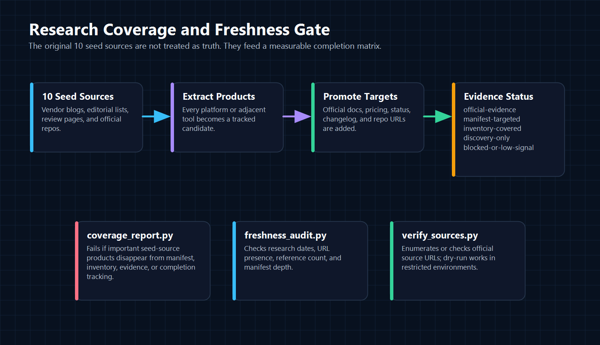

<div align="center">
  

  # Deploy Strategy Advisor

  Source-backed Antigravity skill for making deployment architecture decisions across frontend, backend, databases, realtime, mobile, AI, IoT, DevOps, and self-hosted infrastructure.

  [](#release-state)
  [](#knowledge-base-map)
  [](#research-coverage)
  [](#validation)
  [](#license)
</div>

---

## The Point

Most deployment advice fails in predictable ways:

- It over-recommends familiar defaults like Vercel, Railway, Render, or Supabase.
- It quotes stale pricing, removed free tiers, or wrong platform limits.
- It ignores workload constraints such as WebSockets, background jobs, GPU, data residency, HIPAA, BYOC, and database shape.
- It compares frontend hosts against full-stack platforms without naming the difference.
- It treats third-party blog posts as truth instead of discovery.

Deploy Strategy Advisor exists to make an Antigravity agent slow down, classify the project, read the right reference files, verify current official sources, compare a fair candidate set, and return a usable deployment plan with costs, gotchas, rejected alternatives, and source verification.

This repository is not a static "best platforms" list. It is a maintainable deployment decision system.

---

## What The Skill Does

The skill helps answer questions like:

```text
Where should I deploy a Next.js + Postgres SaaS with auth, Stripe, file uploads, preview deployments, and a $50/month budget?
```

```text
I need WebSockets, presence, shared cursors, background jobs, and Postgres. Should I use Railway, Render, Fly.io, Cloud Run, Northflank, or a self-hosted stack?
```

```text
We need HIPAA, SSO, audit logs, private networking, background workers, and a signed BAA. Compare BYOC, AWS-native, and managed PaaS options.
```

It forces the answer to include:

| Required output | Why it matters |
|---|---|
| Selected stack | Avoids vague "it depends" output |
| Estimated monthly cost | Makes pricing tradeoffs explicit |
| Why this stack | Ties the recommendation to user constraints |
| Setup steps | Makes the advice actionable |
| Scaling path | Shows what happens at 10x or 100x usage |
| Limitations and gotchas | Exposes lock-in, quotas, cold starts, egress, sleep behavior, and compliance risks |
| Rejected alternatives | Proves other options were compared |
| Verification | Names the official sources checked for volatile facts |

---

## Visual System

The README graphics were rebuilt as deterministic PNG assets. They use one theme across the repository:

- dark technical background for contrast
- cyan for source and input flow
- green for verification and validated output
- amber for decision/gating logic
- violet for the skill engine and routing layer
- rose for failure checks, rules, and maintenance gates

The PNGs are generated from `scripts/render_readme_assets.ps1`, so the visual system is reproducible instead of being a one-off image dump.

---

## Architecture

The skill uses a hub-and-spoke model. `SKILL.md` stays lean and procedural; `references/` holds detailed knowledge that gets loaded only when relevant.

<div align="center">
  
</div>

### Hub

`SKILL.md` defines the agent behavior:

- classify the project before answering
- gather budget, traffic, team, compliance, region, runtime, database, and scaling constraints
- read source/provenance references before recommending
- apply hard disqualifiers
- calculate cost estimates
- compare a fair candidate set
- include gotchas and rejected alternatives
- verify volatile claims from official sources

### Spokes

The reference nodes are grouped by domain:

- frontend and JAMstack
- backend and container PaaS
- cloud providers
- databases and BaaS
- edge/serverless
- realtime networking
- mobile backends
- AI/GPU infrastructure
- IoT/device deployment
- self-hosted PaaS
- CI/CD, security, observability, pricing, recipes, and decision trees

### Maintenance Layer

The skill includes scripts to keep the knowledge base honest:

- `freshness_audit.py` checks dates, URL presence, reference count, and manifest depth.
- `coverage_report.py` checks seed-source product coverage.
- `verify_sources.py` enumerates or checks source URLs.
- `render_readme_assets.ps1` regenerates the README PNGs.

---

## Decision Router

Every recommendation should move through the same decision pipeline.

<div align="center">
  
</div>

The agent must:

1. Classify the workload.
2. Generate candidates from multiple buckets.
3. Apply hard rules.
4. Verify official sources.
5. Return a final plan with costs, setup, scaling, gotchas, alternatives, and verification.

This prevents lazy defaults. A static site, realtime app, GPU inference API, mobile backend, IoT fleet, enterprise regulated app, and self-hosted VPS deployment should not all receive the same answer.

---

## Stack Model

The skill composes deployment layers. It does not force one vendor across every project.

<div align="center">
  
</div>

It can reason across:

| Layer | Examples |
|---|---|
| Edge and frontend | Vercel, Netlify, Cloudflare Pages, Firebase Hosting, AWS Amplify, Azure Static Web Apps, Tiiny Host |
| Compute | Railway, Render, Fly.io, Heroku, Koyeb, Northflank, Zerops, Sliplane, DigitalOcean App Platform, Google Cloud Run, AWS App Runner, Azure Container Apps |
| Databases | Supabase, Neon, PlanetScale, Turso, MongoDB Atlas, Firestore, DynamoDB, Cosmos DB, RDS/Aurora, Cloud SQL, Azure PostgreSQL |
| BaaS | Supabase, Convex, Nhost, Appwrite, PocketBase, Firebase |
| Realtime | Ably, Pusher, Liveblocks, LiveKit, PubNub, PartyKit, NATS, Kafka, Redpanda, native WebSockets |
| Mobile | Firebase, Supabase, Appwrite, Nhost, Convex, AWS Amplify, Expo EAS, OneSignal, RevenueCat |
| AI and GPU | Modal, RunPod, Replicate, Hugging Face Inference Endpoints, Together AI, Groq, Baseten, BentoCloud, SageMaker, Vertex AI, Azure ML |
| IoT and edge devices | AWS IoT Core, Azure IoT Hub, ThingsBoard, EMQX, HiveMQ, Balena, Edge Impulse |
| Self-hosted | Coolify, Dokploy, CapRover, Dokku, Juno, Kamal, Portainer, Ploi, Laravel Forge |
| Security and ops | Doppler, Infisical, Vault/OpenBao, Trivy, Snyk, Semgrep, Sentry, Better Stack, Grafana Cloud, Datadog |

---

## Research Coverage

The original requirement asked for the 10 seed sources to be mined, expanded, checked against official documentation, and kept up to date.

This is now tracked explicitly.

<div align="center">
  
</div>

The seed-source matrix lives in:

```text
references/24_seed_source_completion_matrix.md
```

It tracks:

- each of the 10 original seed URLs
- source bias and quality
- extracted products
- local coverage status
- newly promoted gap items
- remaining honest gaps
- completion gate criteria

The coverage report currently checks important seed-source products including:

```text
Vercel, Northflank, Netlify, AWS Amplify, Google Cloud Run, Heroku, Render,
DigitalOcean App Platform, Cloudflare Pages, Cloudflare Workers, Azure Static
Web Apps, Firebase Hosting, Tiiny Host, Railway, Fly.io, Koyeb, Zerops,
Sliplane, Qovery, Bunnyshell, Coolify, Dokploy, Appwrite, Dokku, Juno, Kamal,
SST, Jenkins, AWS Lambda, Kinsta, Bunny CDN, Cloudways, CircleCI
```

This does not mean every product has a deep official evidence block yet. It means the gap is now visible, tracked, and testable.

---

## Truth Hierarchy

The skill must not treat third-party rankings as truth.

Use this hierarchy:

1. Official pricing and limits pages.
2. Official docs for runtime behavior, regions, APIs, and deployment flow.
3. Official security/compliance pages.
4. Official changelog and status pages.
5. Official GitHub releases for open-source tools.
6. Third-party comparisons only for discovery and framing.

If a recommendation includes exact pricing, hard limits, free-tier rules, regions, SLA, HIPAA, SOC 2, or deprecation status, the answer should name the official source checked or mark the claim as unverified.

---

## Knowledge Base Map

| File | Purpose |
|---|---|
| `SKILL.md` | Core instructions, classifier, source protocol, routing, hard rules, output template |
| `references/00_source_manifest.md` | Official docs, pricing, status, changelog, repo, and compliance targets |
| `references/01_frontend_platforms.md` | Frontend, static hosting, JAMstack, SSR, frontend PaaS |
| `references/02_backend_platforms.md` | Container PaaS, backend hosting, full-stack services |
| `references/03_database_services.md` | SQL, NoSQL, serverless databases, KV, storage |
| `references/04_cicd_devops.md` | CI/CD, IaC, GitOps, preview environments |
| `references/05_edge_cdn_serverless.md` | Edge functions, CDN, isolate runtimes, serverless limits |
| `references/06_cloud_providers.md` | AWS, GCP, Azure, DigitalOcean, Hetzner, cloud-native options |
| `references/07_self_hosted.md` | VPS and self-hosted PaaS |
| `references/08_monitoring_security.md` | Monitoring, logging, uptime, observability |
| `references/09_ai_ml_specialized.md` | GPU, inference, model serving, AI workload platforms |
| `references/10_architecture_patterns.md` | Monolith, microservices, serverless, edge, event-driven patterns |
| `references/11_pricing_calculator.md` | Cost estimation patterns |
| `references/12_stack_recipes.md` | Budget-based and workload-based stack recipes |
| `references/13_realtime_networking.md` | WebSockets, collaboration, pub/sub, media, brokers |
| `references/14_security_secrets.md` | Secrets, scanning, container security, supply chain |
| `references/15_emerging_platforms.md` | Northflank, Zerops, Sliplane, Qovery, Bunnyshell, Tiiny Host |
| `references/16_baas_platforms.md` | Supabase, Convex, Nhost, Appwrite, PocketBase |
| `references/17_mobile_backends.md` | Mobile backend, push, app builds, OTA updates |
| `references/18_decision_tree.md` | Multi-dimensional routing logic |
| `references/19_auto_update_protocol.md` | Legacy freshness protocol retained for continuity |
| `references/20_platform_inventory.md` | Broad market inventory and comparison axes |
| `references/21_research_and_refresh_workflow.md` | Recommendation-time and update-time source verification protocol |
| `references/22_iot_edge_deployments.md` | IoT fleet, MQTT, OTA, telemetry, device security |
| `references/23_verified_evidence_original_prompt.md` | Official-source evidence for the original prompt core platform set |
| `references/24_seed_source_completion_matrix.md` | Completion tracker for the original 10 seed URLs |
| `scripts/freshness_audit.py` | Offline freshness and provenance audit |
| `scripts/coverage_report.py` | Seed-source product coverage report |
| `scripts/verify_sources.py` | Source URL enumerator/checker |
| `scripts/render_readme_assets.ps1` | Deterministic PNG renderer for README graphics |

---

## Installation

Clone the skill into your global Antigravity skills directory:

```bash
git clone https://github.com/kunal-gh/deploy-skill.git ~/.gemini/config/skills/deploy-strategy
```

On Windows:

```powershell
git clone https://github.com/kunal-gh/deploy-skill.git "$env:USERPROFILE\.gemini\config\skills\deploy-strategy"
```

Restart Antigravity after installation so the skill is discovered.

---

## Usage

Ask naturally, but include constraints. Better context creates better deployment architecture.

### Minimal

```text
Use deploy-strategy. I have a Next.js app with Postgres and auth. Budget is $25/month. What should I deploy on?
```

### Full-stack SaaS

```text
Use deploy-strategy. I am building a commercial SaaS MVP with Next.js, Node.js, Postgres, Redis, Stripe billing, email auth, and file uploads. Budget is $50/month. I expect 10,000 MAU in the first 6 months. I need preview deployments, low ops burden, and a clean upgrade path. What stack should I use and why?
```

### Realtime

```text
Use deploy-strategy. I am building a collaborative whiteboard with WebSockets, presence, shared cursors, Postgres persistence, and 25,000 MAU. Budget is $200/month. Compare managed realtime providers against self-hosted Socket.IO and tell me the safest deployment architecture.
```

### Enterprise

```text
Use deploy-strategy. We need to deploy a healthcare workflow app with HIPAA requirements, audit logs, SSO, Postgres, background jobs, private networking, and a signed BAA. Compare BYOC, AWS-native, and managed PaaS options.
```

---

## Validation

Run these before publishing changes:

```bash
python scripts/freshness_audit.py .
python scripts/coverage_report.py .
python scripts/verify_sources.py . --dry-run --limit 25
python -c "import ast, pathlib; [ast.parse(p.read_text(encoding='utf-8')) for p in [pathlib.Path('scripts/freshness_audit.py'), pathlib.Path('scripts/verify_sources.py'), pathlib.Path('scripts/coverage_report.py')]]; print('syntax ok')"
```

Regenerate README PNG assets:

```powershell
powershell -ExecutionPolicy Bypass -File .\scripts\render_readme_assets.ps1
```

Expected state:

- freshness audit has no failures
- freshness audit has no warnings
- coverage report has no failures
- coverage report has no warnings
- source verifier dry-run enumerates sources
- scripts parse successfully
- README PNGs render readable text

---

## Release State

| Item | Current state |
|---|---|
| Version | `3.2.0` |
| Reference nodes | `25` |
| Core prompt evidence | Present |
| Original 10-source completion matrix | Present |
| Freshness audit | Passing |
| Coverage report | Passing |
| Source verifier dry run | Passing |
| README PNG theme | Rebuilt and reproducible |

Honest limitation: this still cannot make cloud facts permanent. Pricing, limits, free tiers, and compliance claims change. The durable part is the process: official-source targets, freshness checks, coverage tracking, and verification before recommendations.

---

## Maintenance Workflow

When adding or updating a platform:

1. Add the platform to `references/20_platform_inventory.md`.
2. Add official docs, pricing, status, changelog, repo, and compliance targets to `references/00_source_manifest.md`.
3. Update the relevant domain reference.
4. Add `verified_at: YYYY-MM-DD`.
5. Include official source URLs.
6. Update `references/24_seed_source_completion_matrix.md` if the platform came from a seed source.
7. Run all validation commands.
8. Commit only source-backed changes.

Recommended evidence block:

```text
verification_status: official-sources-checked
verified_at: YYYY-MM-DD
official_sources:
  pricing: URL
  docs: URL
  limits: URL
  changelog_or_status: URL
evidence_notes:
  - Confirmed exact fact from source.
  - Confirmed limitation, removed free tier, or operational gotcha.
```

---

## Roadmap

High-value next expansions:

- Enterprise compliance matrix: SOC 2, HIPAA/BAA, ISO 27001, PCI, DORA, SSO, SCIM, audit logs, SLA.
- Deeper official evidence blocks for every `manifest-targeted` product.
- Dedicated analytics/data warehouse node: ClickHouse, PostHog, BigQuery, Snowflake, MotherDuck, DuckDB.
- AI agent infrastructure node: sandboxes, remote execution, secure code runners, MCP hosting, eval pipelines.
- Regional strategy coverage for India, EU, US, and latency-sensitive global apps.
- Forward tests using realistic deployment prompts.

---

## License

Apache-2.0.

---

<div align="center">
  
  <br>
  <strong>Built for Antigravity. Designed for source-backed deployment decisions.</strong>
</div>
