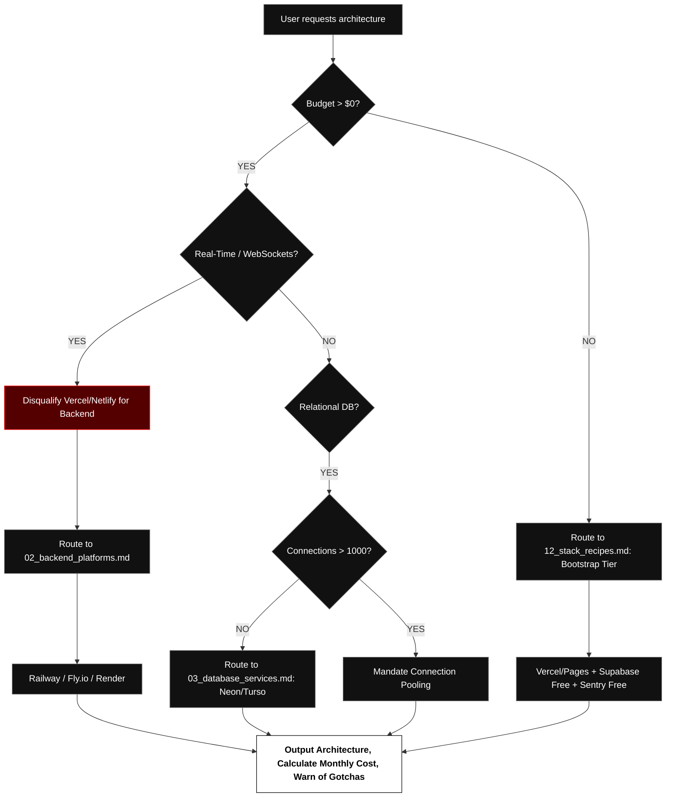
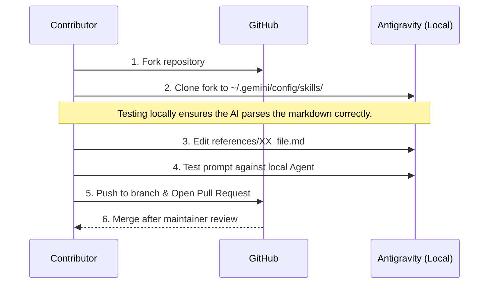

# DEPLOY STRATEGY ADVISOR
### Antigravity Principal Cloud Architect Skill
**Version:** 1.0.0 | **License:** Apache 2.0 | **Status:** Production-Ready

---

## 1. THE PROBLEM
The 2026 cloud ecosystem is fundamentally fragmented. The "Serverless vs. Edge vs. Container" debate has resulted in developers suffering from choice paralysis, vendor lock-in, and catastrophic bill shocks. 

Most AI assistants hallucinate pricing or give generic "it depends" advice. **Deploy Strategy Advisor** is a deterministic, mathematically backed Principal Cloud Architect designed natively for the Google Antigravity framework. It forces the AI to cross-reference your constraints against 14 exhaustive, up-to-date data modules before returning an opinionated architecture stack.

---

## 2. CODEBASE ARCHITECTURE
The system operates on a strict **Hub-and-Spoke** architecture to prevent AI context-window exhaustion and hallucination. 

```mermaid
graph TD
    %% Brutalist Aesthetic
    classDef hub fill:#000,stroke:#fff,stroke-width:2px,color:#fff,font-weight:bold;
    classDef spoke fill:#222,stroke:#aaa,stroke-width:1px,color:#ddd;
    classDef action fill:#fff,stroke:#000,stroke-width:2px,color:#000,font-weight:bold;

    User([User Prompt]) --> Hub

    subgraph The Core Engine
        Hub{SKILL.md}:::hub
        Hub -- "Extracts Context" --> Params[Budget, Traffic, Tech Stack]:::action
        Params -- "Routes to" --> Nodes
    end

    subgraph The Knowledge Base (References)
        Nodes((Data Nodes)):::spoke
        Nodes -.-> F1[01_frontend_platforms.md]:::spoke
        Nodes -.-> F2[02_backend_platforms.md]:::spoke
        Nodes -.-> F3[03_database_services.md]:::spoke
        Nodes -.-> F4[13_realtime_networking.md]:::spoke
        Nodes -.-> F5[14_security_secrets.md]:::spoke
    end

    Nodes -- "Data Retrieved" --> Verify[search_web: Live Pricing Verify]:::action
    Verify -- "Final Math" --> Output([Highly Opinionated Stack Output])
```

### 2.1 The Hub (`SKILL.md`)
The `SKILL.md` file is the instruction manual. It does not contain any pricing data. Instead, it defines the **Persona** (Objective, Opinionated, Detailed) and the **Execution Workflow** (Gather Context -> Read References -> Verify Live Pricing -> Detail Limitations).

### 2.2 The Spokes (`references/*.md`)
The `references/` directory contains 14 isolated, highly detailed markdown files acting as local databases. When you mention "React", the AI reads `01_frontend_platforms.md`. When you mention "WebSockets", it is forced to read `13_realtime_networking.md` which informs the AI that serverless edge functions cannot sustain persistent WebSockets.

---

## 3. THE DECISION WORKFLOW

To understand how the AI arrives at its conclusions, review the brutalist logic matrix below.



---

## 4. USAGE INSTRUCTIONS (ANTIGRAVITY)

### 4.1 Installation
This skill runs natively in your Antigravity global customizations folder.
```bash
# Clone directly into your Antigravity skills directory
git clone https://github.com/kunal-gh/deploy-skill.git ~/.gemini/config/skills/deploy-strategy
```
*Note: Restart your Antigravity IDE after cloning to ensure the `SKILL.md` is registered.*

### 4.2 Triggering the AI
You do not need to invoke special commands. Simply ask your Antigravity agent a deployment question. To get the best results, provide the required context variables:

**Optimal Prompt Structure:**
> "I am building a **[Tech Stack]** for a **[Project Type]**. I expect **[Traffic Limit]** and my budget is **[Budget]**. Do I need **[Special Requirements]**? What is the best deployment strategy?"

**Example Real-World Prompt:**
> "I'm building a SaaS MVP with Next.js, Postgres, and Redis. We need collaborative cursors (WebSockets). My budget is $50/mo total. We expect 10,000 MAU. What should we use?"

**Expected AI Output:**
1. **Identification:** The AI will immediately flag that WebSockets disqualify Vercel for backend compute.
2. **Compute Routing:** It will route to Railway or Fly.io (Container PaaS).
3. **Database Routing:** It will calculate that $50/mo easily covers a Railway Postgres/Redis instance or a Supabase Pro tier.
4. **Gotcha Warning:** It will warn you that container autoscaling on Railway is charged per-minute, so you must set a hard billing limit to prevent DDOS bankruptcy.

---

## 5. CONTRIBUTION GUIDELINES

The cloud landscape changes rapidly. When Railway removes a free tier, or Vercel changes bandwidth pricing, this repository must be updated.

We rely on the open-source community to keep the 14 reference nodes mathematically accurate.

### 5.1 The Contribution Workflow



### 5.2 Step-by-Step Guide

1. **Fork and Clone Locally:**
   Clone your fork directly into your Antigravity skills folder so you can test it live.
   ```bash
   git clone https://github.com/YOUR_USER/deploy-skill.git ~/.gemini/config/skills/deploy-strategy
   ```

2. **Locate the Correct Node:**
   Do not add data to the wrong file. If you are updating pricing for a Database, edit `references/03_database_services.md`. Do not pollute the core `SKILL.md` with raw data.

3. **Format Standards (Brutalism):**
   - Keep markdown tables clean and aligned.
   - Use bold text for **Pricing** and **Hard Limits**.
   - Do not add subjective opinions to the reference files (e.g., "I think AWS is bad"). Only add facts (e.g., "AWS Egress costs $0.09/GB, which is 9x higher than Cloudflare"). The AI will form opinions based on the facts.

4. **Testing Your Changes:**
   Open Antigravity and prompt the agent:
   > "Read `references/03_database_services.md`. What is the new pricing for [Platform You Updated]?"
   Ensure the AI parses your table correctly.

5. **Commit and PR:**
   Use semantic commit messages to ensure the Git history remains immaculate:
   ```bash
   git commit -m "docs(database): update Neon Postgres free tier limits for Q3 2026"
   ```

---

<div align="center">
  <b>Built for Google Antigravity. Architected for 2026.</b>
</div>
