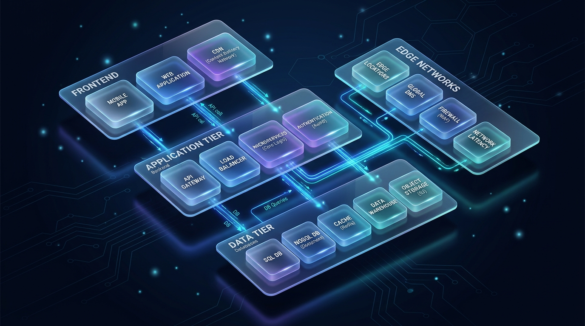

<div align="center">
  
  
  # 🚀 Elite Deployment Strategy Advisor (Antigravity Skill)
  
  **The ultimate Principal Cloud Architect installed directly into your AI agent.**
  
  [](#)
  [](#)
  [](#)
  [](#)

</div>

---

## 🛑 The "Why": The 2026 Cloud Deployment Crisis

In 2026, the landscape of cloud deployment, PaaS (Platform as a Service), and Serverless infrastructure has become overwhelmingly complex. Developers are drowning in choices, hidden fees, and "gotchas" that don't reveal themselves until the first massive invoice arrives.

- **Vercel** is phenomenal for DX but can bankrupt you if you use it for heavy background tasks or WebSockets.
- **Heroku** has largely stagnated, forcing massive migrations.
- **AWS and GCP** remain incredibly powerful but are increasingly hostile to solo developers or small startups without dedicated DevOps engineers.
- **Self-hosting** (Coolify, Dokploy) is undergoing a renaissance, but requires deep knowledge of Linux and Docker.

### Enter the Deploy Strategy Advisor

This repository is not just a guide—it is a **living, breathing AI skill** built for the Google Antigravity framework. By installing this skill, your Antigravity AI agent absorbs the knowledge of a Principal Cloud Architect.

Instead of answering deployment questions with wishy-washy "it depends" responses, the agent will analyze your tech stack, your budget, your traffic, and your team size to output a **highly opinionated, mathematically backed, production-ready infrastructure stack.**

---

## 🏗️ What This Skill Does

<div align="center">
  
</div>

When you trigger this skill in your Antigravity workspace, the AI doesn't just recommend a "server." It builds a complete, robust stack covering:

1. **Compute Layer** (Where does your code actually run? Micro-VMs? Serverless edge? Kubernetes?)
2. **Database Layer** (Managed Postgres? Edge SQLite? Mongo?)
3. **Caching Layer** (Redis? Upstash?)
4. **Real-time Networking** (WebSockets? Ably? Pusher? Kafka?)
5. **Observability** (Datadog? Sentry? Grafana? BetterStack?)
6. **Secrets Management** (Doppler? Infisical? Hashicorp Vault?)
7. **CI/CD** (GitHub Actions? GitLab? ArgoCD?)

The agent will cross-reference your specific constraints against **14 highly detailed reference files** containing the exact 2026 pricing limits and hidden costs of over 50 different platforms.

---

## 🧠 The AI Decision Engine

<div align="center">
  
</div>

How does the AI know what to recommend? The `SKILL.md` file acts as the "Brain," routing the AI's logic through a strict execution workflow:

### 1. Context Extraction
The AI will halt and demand answers if you don't provide them. It needs to know:
- **Tech stack**: (e.g., Next.js, Django, FastAPI)
- **Project type**: (e.g., SaaS, Mobile Backend, AI Inference)
- **Budget**: ($0? $50? $5,000?)
- **Expected Traffic**: (Will you hit the free tier limits?)
- **Real-time Needs**: (Are WebSockets required? This immediately disqualifies Serverless platforms).

### 2. Live Pricing Verification
The AI is instructed to use the Antigravity `search_web` tool to verify the *live* 2026 pricing of any platform it intends to recommend, ensuring you never receive outdated advice.

### 3. The "Gotchas" Requirement
The AI is strictly mandated to include a "Limitations and Gotchas" section in every recommendation. It will warn you about bill shock (like Vercel's bandwidth overages) or vendor lock-in risks before you commit to an architecture.

---

## 🗃️ The Knowledge Base Structure

The sheer volume of data required to make these decisions is staggering. To prevent context-window overflow and AI hallucination, the data is modularized into 14 distinct files within the `references/` directory. 

*The AI only loads the files relevant to your specific query.*

### 🚀 Compute & Hosting
- **`01_frontend_platforms.md`**: Vercel, Netlify, Cloudflare Pages, Firebase Hosting, AWS Amplify. (Covers Edge Functions, SSR optimization, bandwidth limits).
- **`02_backend_platforms.md`**: Railway, Render, Fly.io, Heroku, Northflank, Koyeb, Zerops, Qovery. (Covers containerization, Micro-VMs, RAM/CPU pricing).
- **`06_cloud_providers.md`**: AWS, GCP, Azure, DigitalOcean, Hetzner, Vultr, Linode. (Covers raw IaaS, egress fees, managed Kubernetes).
- **`05_edge_cdn_serverless.md`**: Cloudflare Workers, Deno Deploy, Fastly, Lambda@Edge. (Covers V8 isolates, sub-millisecond cold starts, CPU time limits).
- **`07_self_hosted.md`**: Coolify, Dokploy, CapRover, Dokku, Appwrite, PocketBase. (Covers running your own PaaS on cheap VPS hardware).

### 💾 Data & State
- **`03_database_services.md`**: Supabase, Neon, PlanetScale, Turso, Upstash. (Covers Serverless Postgres, SQLite at the Edge, Connection Pooling limits).
- **`13_realtime_networking.md`**: Ably, Pusher, Liveblocks, LiveKit, NATS, Kafka. (Covers WebSocket limits, message quotas, latency, CRDTs).

### 🔒 DevSecOps & Pipelines
- **`04_cicd_devops.md`**: GitHub Actions, GitLab CI, ArgoCD, Terraform, OpenTofu.
- **`08_monitoring_security.md`**: Datadog, Sentry, Grafana Cloud, Axiom, BetterStack. (Covers Error tracking, Uptime monitoring, Logs, APM).
- **`14_security_secrets.md`**: Doppler, Infisical, Vault, Trivy, Snyk, Gitleaks. (Covers Secrets injection, Supply chain security, SHA pinning).

### 🤖 Specialized
- **`09_ai_ml_specialized.md`**: Modal, RunPod, Replicate, Together AI, HuggingFace. (Covers A100/H100 GPU per-minute pricing, inference endpoints).
- **`10_architecture_patterns.md`**: Monoliths vs Microservices vs Serverless.
- **`11_pricing_calculator.md`**: Exact math formulae for calculating cloud costs at scale.
- **`12_stack_recipes.md`**: Pre-built standardized stacks for $0, $15, and $500+ budgets.

---

## 🛠️ Installation Guide

This skill is designed to run locally on your machine via the Google Antigravity IDE.

### Step 1: Locate your Customizations Root
By default, Antigravity loads skills from your global customizations root:
- **Windows:** `C:\Users\YourUsername\.gemini\config\skills`
- **Mac/Linux:** `~/.gemini/config/skills`

### Step 2: Clone the Repository
Open your terminal and clone this repository directly into your skills directory:

```bash
# Navigate to the skills directory (adjust path for Windows)
cd ~/.gemini/config/skills/

# Clone the repo
git clone https://github.com/kunal-gh/deploy-skill.git deploy-strategy
```

### Step 3: Verify
Restart your Antigravity IDE or CLI. The agent will automatically discover the `SKILL.md` file in the `deploy-strategy` folder. You do not need to configure any JSON files manually.

---

## 💬 How to Use the Skill (Prompts)

Once installed, simply talk to your Antigravity agent. The skill activates automatically when it detects deployment or architecture keywords.

### Example 1: The Bootstrapper
> *"I'm building a SaaS MVP with Next.js and Prisma. I have exactly $0. I don't want to pay a single cent until I get my first paying customer. I need a Postgres database and basic error tracking. What is the best architecture?"*

**Expected AI Behavior:**
The AI will read `12_stack_recipes.md` and `01_frontend_platforms.md`. It will likely recommend Cloudflare Pages for the frontend (unlimited free bandwidth), a Supabase free tier for the database, and Sentry for free error tracking. It will warn you about Supabase's project-pause policy for inactive free databases.

### Example 2: The Scale-Up
> *"My Python/FastAPI backend on Heroku is getting crushed. We're paying $300/mo and getting terrible performance. We process millions of websocket events. I want to migrate to something Docker-based with auto-scaling. Budget is $150/mo. What should we do?"*

**Expected AI Behavior:**
The AI will read `02_backend_platforms.md` and `13_realtime_networking.md`. It will identify that WebSockets require persistent connections. It will likely recommend migrating to Railway or Fly.io for container orchestration, drastically cutting costs while improving performance.

### Example 3: The Enterprise Edge
> *"We need to deploy a global AI inference app. Our frontend is React, but our backend needs to run custom Python models on GPUs (A100s). We also need strict secrets management because we are handling API keys. We have enterprise budget."*

**Expected AI Behavior:**
The AI will dive into `09_ai_ml_specialized.md` (Modal/RunPod) for the GPU compute, `01_frontend_platforms.md` for the React edge delivery, and `14_security_secrets.md` for Doppler or Infisical integration. It will output a highly complex, multi-vendor architecture map.

---

## 🔒 Security & Best Practices

Cloud architecture isn't just about servers; it's about not getting hacked. The `deploy-strategy` skill enforces strict DevSecOps rules:
- It will **never** recommend hardcoding `.env` files for production setups.
- It will proactively suggest tools like **Trivy** for container scanning if you mention Docker.
- It is aware of the latest supply chain attacks (e.g., the 2026 Trivy incident) and will advise you to pin your GitHub Actions to specific commit SHAs.

---

## 🤝 Contributing

This knowledge base is updated continuously. Cloud providers change their pricing models and free tiers every few months (e.g., Railway removing their free tier, Heroku ending free dynos, etc.).

If you spot an outdated price or a new platform that deserves inclusion:
1. Fork the repository.
2. Update the relevant markdown file in the `references/` directory.
3. Submit a Pull Request.

Your contribution will make every Antigravity agent in the world a little bit smarter.

---

<div align="center">
  <i>"Architecture is about the important stuff. Whatever that is." - Ralph Johnson</i><br><br>
  <b>Built for Google Antigravity</b>
</div>
