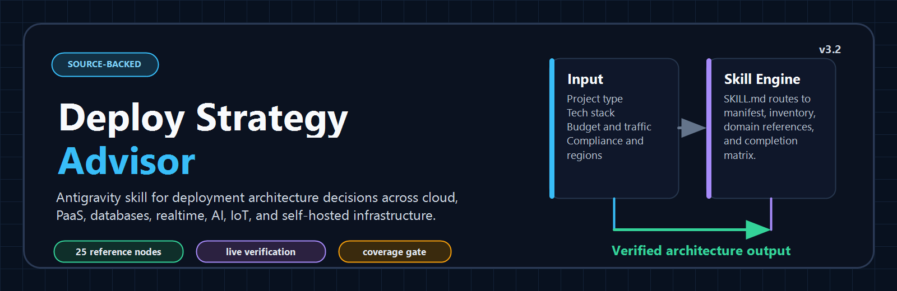
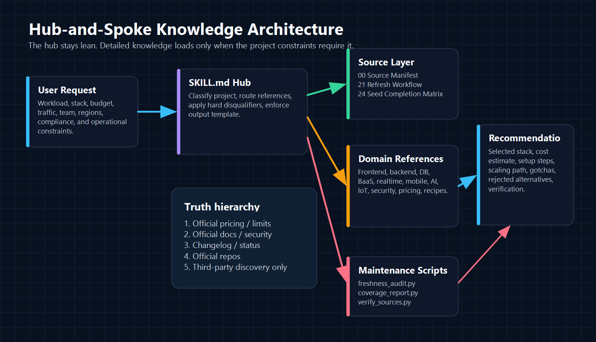
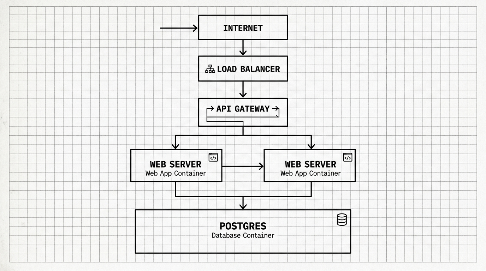

<div align="center">
  

  # Deploy Strategy Advisor

  Source-backed Antigravity skill for choosing deployment architectures across frontend, backend, databases, mobile, realtime, AI, IoT, DevOps, and self-hosted infrastructure.

  [](#validation)
  [](#release-state)
  [](#knowledge-base-map)
  [](#freshness-and-source-verification)
  [](#license)
</div>

---

## What This Is

Deploy Strategy Advisor is a global Antigravity skill that helps an AI agent act like a practical principal cloud architect instead of a generic deployment chatbot.

It is designed for questions like:

- "Where should I deploy this Next.js + Postgres SaaS?"
- "Should I use Vercel, Railway, Render, Fly.io, Northflank, Cloud Run, or a VPS?"
- "What is the cheapest safe stack for 10,000 monthly active users?"
- "My app needs WebSockets, background jobs, Postgres, and Redis. What should I use?"
- "What deployment strategy fits an IoT, mobile, AI inference, or enterprise app?"
- "What are the tradeoffs between managed PaaS, hyperscaler services, BYOC, and self-hosting?"

The skill does not try to memorize the cloud forever. Instead, it combines:

1. A strict decision workflow in `SKILL.md`.
2. A broad platform inventory so common options are not missed.
3. Domain-specific reference files that are loaded only when needed.
4. Official-source targets for pricing, limits, docs, security, status, and changelogs.
5. A refresh protocol that requires live verification before quoting volatile facts.
6. Maintenance scripts that audit source coverage and freshness dates.

---

## Why It Exists

Deployment advice is usually weak in three ways:

| Failure mode | What usually happens | What this skill enforces |
|---|---|---|
| Generic recommendations | "Use Vercel" or "Use Railway" for almost every app | Project classification, constraints, hard disqualifiers, and rejected alternatives |
| Hallucinated pricing | AI quotes stale free tiers, removed plans, or wrong limits | Official pricing/docs/changelog verification before final advice |
| Narrow platform awareness | Only famous frontend/PaaS tools are considered | Managed, hyperscaler, self-hosted, BYOC, BaaS, realtime, mobile, AI, IoT, and security buckets |
| Hidden tradeoffs | Lock-in, egress, sleeping services, WebSocket limits, compliance gaps are skipped | Mandatory limitations, gotchas, scaling path, and source verification section |
| Stale knowledge | The database ages silently | Freshness audit, source manifest, and recommendation-time refresh workflow |

The goal is not to crown one platform. The goal is to choose the right stack for the workload, budget, team, region, compliance needs, data model, runtime constraints, and growth path.

---

## Architecture

The repository follows a hub-and-spoke layout. The hub is compact and procedural; the spokes hold the detailed knowledge.

<div align="center">
  
</div>

### Hub

`SKILL.md` defines the operating behavior:

- classify the project before answering
- gather budget, traffic, team, compliance, region, runtime, database, and scaling constraints
- load only relevant reference files
- verify volatile facts against official sources
- compare a fair candidate set
- explain why alternatives were rejected
- include limitations, gotchas, and a scaling path

### Spokes

`references/` contains the knowledge base. Files are grouped by domain so an agent can load the minimum useful context instead of flooding the prompt.

### Scripts

`scripts/` contains lightweight maintenance checks:

- `freshness_audit.py` checks reference count, research dates, URL presence, and manifest coverage.
- `verify_sources.py` enumerates or checks source URLs, with `--dry-run` support for restricted environments.
- `coverage_report.py` checks that products discovered from the original 10 seed sources are visible in the manifest, inventory, evidence register, or completion matrix.

---

## Decision Flow

Every recommendation is meant to follow this path:

<div align="center">
  
</div>

1. Classify the workload.
2. Gather hard constraints.
3. Generate candidates from multiple buckets.
4. Apply disqualifiers.
5. Verify official source pages for shortlisted tools.
6. Estimate cost.
7. Recommend a stack.
8. Explain gotchas and rejected alternatives.
9. Provide setup and scaling guidance.

The skill is intentionally opinionated, but not platform-biased. It should recommend a simple free stack when that is enough, a managed platform when speed matters, hyperscaler services when scale/compliance demands them, and self-hosted infrastructure when cost/control justifies the operational burden.

---

## System Blueprint

The advisor thinks in layers: edge delivery, compute, data, observability, security, CI/CD, and operations.

<div align="center">
  
</div>

Typical output includes:

- frontend or edge hosting
- backend compute
- relational/document/KV/vector/time-series data layer
- cache and queue layer
- file/object storage
- realtime or messaging layer
- CI/CD pipeline
- secrets manager
- monitoring, logging, and error tracking
- estimated monthly cost
- scaling path
- gotchas
- rejected alternatives
- verification sources

---

## What It Can Compare

This is the current coverage shape. Exact facts still need live official verification before being quoted to a user.

| Area | Examples covered |
|---|---|
| Frontend and JAMstack | Vercel, Netlify, Cloudflare Pages, Firebase Hosting, AWS Amplify, Azure Static Web Apps, GitHub Pages, Tiiny Host, YouWare |
| Backend and PaaS | Railway, Render, Fly.io, Heroku, Koyeb, Northflank, Zerops, Sliplane, DigitalOcean App Platform, Google Cloud Run, AWS App Runner, Azure Container Apps, Kinsta application hosting, Cloudways |
| BYOC and Kubernetes platforms | Northflank BYOC, Qovery, Flightcontrol, Porter, Bunnyshell, Argo CD, Flux |
| Self-hosted PaaS | Coolify, Dokploy, CapRover, Dokku, Juno, Kamal, Portainer, Ploi, Laravel Forge |
| Databases | Supabase, Neon, PlanetScale, Turso, MongoDB Atlas, Firestore, DynamoDB, Cosmos DB, RDS/Aurora, Cloud SQL, Azure PostgreSQL |
| BaaS | Supabase, Convex, Nhost, Appwrite, PocketBase, Firebase |
| Edge and serverless | Cloudflare Workers, Deno Deploy, Fastly Compute, AWS Lambda, Lambda@Edge, Cloud Run, Bunny CDN |
| Realtime | Ably, Pusher, Liveblocks, LiveKit, PubNub, PartyKit, NATS, Kafka, Redpanda, native WebSockets |
| Mobile | Firebase, Supabase, Appwrite, Nhost, Convex, AWS Amplify, Expo EAS, OneSignal, RevenueCat |
| AI and GPU | Modal, RunPod, Replicate, Hugging Face Inference Endpoints, Together AI, Groq, Baseten, BentoCloud, SageMaker, Vertex AI, Azure ML |
| IoT and edge devices | AWS IoT Core, Azure IoT Hub, ThingsBoard, EMQX, HiveMQ, Balena, Edge Impulse |
| DevOps and IaC | GitHub Actions, GitLab CI/CD, CircleCI, Buildkite, Argo CD, Flux, Terraform, OpenTofu, Pulumi |
| Observability and security | Sentry, Better Stack, Grafana Cloud, Datadog, Axiom, SigNoz, Doppler, Infisical, Vault/OpenBao, Trivy, Snyk, Semgrep |

---

## Knowledge Base Map

| File | Purpose |
|---|---|
| `SKILL.md` | Core agent instructions, decision workflow, hard rules, and output template |
| `references/00_source_manifest.md` | Official docs, pricing, changelog, status, repo, and compliance targets |
| `references/01_frontend_platforms.md` | Frontend, static hosting, JAMstack, Next.js/SSR, frontend PaaS notes |
| `references/02_backend_platforms.md` | Container PaaS, backend hosting, full-stack services, platform tradeoffs |
| `references/03_database_services.md` | SQL, NoSQL, serverless databases, KV, storage, data-layer decisions |
| `references/04_cicd_devops.md` | CI/CD, IaC, GitOps, pipelines, preview environments |
| `references/05_edge_cdn_serverless.md` | Edge functions, CDN, isolate runtimes, serverless constraints |
| `references/06_cloud_providers.md` | AWS, GCP, Azure, DigitalOcean, Hetzner, and cloud-native options |
| `references/07_self_hosted.md` | VPS and self-hosted PaaS options |
| `references/08_monitoring_security.md` | Observability, logging, monitoring, uptime checks |
| `references/09_ai_ml_specialized.md` | GPU, inference, model serving, AI workload platforms |
| `references/10_architecture_patterns.md` | Monolith, modular monolith, microservices, serverless, edge, event-driven patterns |
| `references/11_pricing_calculator.md` | Cost estimation patterns for compute, memory, storage, egress, and seats |
| `references/12_stack_recipes.md` | Budget-based and workload-based stack recipes |
| `references/13_realtime_networking.md` | WebSockets, realtime collaboration, pub/sub, media, message brokers |
| `references/14_security_secrets.md` | Secrets, scanning, container security, supply-chain safety |
| `references/15_emerging_platforms.md` | Northflank, Zerops, Sliplane, Qovery, Bunnyshell, Tiiny Host |
| `references/16_baas_platforms.md` | Supabase, Convex, Nhost, Appwrite, PocketBase |
| `references/17_mobile_backends.md` | Mobile backend, push, app builds, OTA updates, mobile observability |
| `references/18_decision_tree.md` | Multi-dimensional routing logic |
| `references/19_auto_update_protocol.md` | Legacy freshness protocol retained for continuity |
| `references/20_platform_inventory.md` | Broad market inventory and comparison axes |
| `references/21_research_and_refresh_workflow.md` | Recommendation-time and update-time source verification protocol |
| `references/22_iot_edge_deployments.md` | IoT fleet, MQTT, OTA, telemetry, device security |
| `references/23_verified_evidence_original_prompt.md` | Official-source evidence pass for the original Vercel-alternatives prompt set |
| `references/24_seed_source_completion_matrix.md` | Completion tracker for the original 10 seed URLs and newly promoted gap items |
| `scripts/freshness_audit.py` | Offline provenance and freshness audit |
| `scripts/verify_sources.py` | URL discovery/checking utility for source pages |
| `scripts/coverage_report.py` | Seed-source product coverage report |

---

## Installation

Clone the skill into your global Antigravity skills directory:

```bash
git clone https://github.com/kunal-gh/deploy-skill.git ~/.gemini/config/skills/deploy-strategy
```

Restart Antigravity after installation so the skill is discovered.

On Windows, the equivalent target is usually:

```powershell
git clone https://github.com/kunal-gh/deploy-skill.git "$env:USERPROFILE\.gemini\config\skills\deploy-strategy"
```

---

## How To Use

Ask Antigravity a deployment question naturally. Better input gives better architecture decisions.

### Minimal prompt

```text
Use deploy-strategy. I have a Next.js app with Postgres and auth. Budget is $25/month. What should I deploy on?
```

### Better prompt

```text
Use deploy-strategy. I am building a commercial SaaS MVP with Next.js, Node.js API routes, Postgres, Redis, Stripe billing, email auth, and file uploads. Budget is $50/month. I expect 10,000 MAU in the first 6 months. I need preview deployments, low ops burden, and a clean upgrade path. What stack should I use and why?
```

### Realtime prompt

```text
Use deploy-strategy. I am building a collaborative whiteboard with WebSockets, presence, shared cursors, Postgres persistence, and 25,000 MAU. Budget is $200/month. Compare managed realtime providers against self-hosted Socket.IO and tell me the safest deployment architecture.
```

### Enterprise prompt

```text
Use deploy-strategy. We need to deploy a healthcare workflow app with HIPAA requirements, audit logs, SSO, Postgres, background jobs, private networking, and a signed BAA. Compare BYOC, AWS-native, and managed PaaS options.
```

---

## Expected Answer Shape

The skill is instructed to return a structured architecture plan:

```markdown
## Recommended Architecture for [Project]

### Selected Stack
| Layer | Service | Plan | Est. Monthly Cost |
|---|---|---|---|

### Why This Stack

### Setup Steps

### Scaling Path

### Limitations & Gotchas

### Rejected Alternatives

### Verification
```

That last section matters. If the answer quotes pricing, limits, free tiers, regions, SLAs, compliance claims, or deprecations, it should name the official sources checked.

---

## Freshness And Source Verification

Cloud deployment facts rot quickly. Free tiers disappear, overages change, regions expand, platforms add or remove runtimes, and compliance claims evolve.

This skill uses a truth hierarchy:

1. Official pricing and limits pages.
2. Official docs for runtime behavior, regions, APIs, and deployment flow.
3. Official security/compliance pages.
4. Official changelog/status pages.
5. Official GitHub releases for open-source tools.
6. Third-party comparisons only for discovery.

Before a pricing-heavy recommendation, run:

```bash
python scripts/freshness_audit.py .
python scripts/coverage_report.py .
python scripts/verify_sources.py . --dry-run
```

When network access is available and you want live URL checks:

```bash
python scripts/verify_sources.py . --output verification/source-check.csv
```

The `--dry-run` mode is useful inside restricted coding environments because it confirms URL coverage without making network requests.

---

## Validation

Current validation commands:

```bash
python scripts/freshness_audit.py .
python scripts/coverage_report.py .
python scripts/verify_sources.py . --dry-run --limit 25
python -c "import ast, pathlib; [ast.parse(p.read_text(encoding='utf-8')) for p in [pathlib.Path('scripts/freshness_audit.py'), pathlib.Path('scripts/verify_sources.py'), pathlib.Path('scripts/coverage_report.py')]]; print('syntax ok')"
```

Expected result:

- freshness audit reports no failures
- freshness audit reports no warnings
- coverage report reports no failures
- source verifier enumerates official and discovery URLs
- Python scripts parse successfully

---

## Hard Decision Rules

Some requirements should immediately remove platforms from contention.

| Requirement | Decision implication |
|---|---|
| Persistent WebSockets | Do not use short-lived serverless functions as the primary backend |
| Long background jobs | Avoid frontend/serverless-only platforms unless a job runner is added |
| Strict GDPR/data residency | Verify exact EU region/data processing support |
| HIPAA/BAA | Require official BAA support and enterprise-grade controls |
| BYOC required | Compare Northflank, Qovery, Flightcontrol, Porter, or direct cloud-native services |
| Budget is truly $0 | Avoid paid minimums, trial-only tiers, sleeping production backends, and non-commercial restrictions |
| Global low latency | Compare edge runtimes, Fly.io, Cloud Run regions, and CDN behavior |
| SQL-heavy workload | Prefer true Postgres/MySQL-compatible options over proprietary NoSQL-only stacks |
| AI/GPU workload | Compare GPU platforms and cold-start/runtime constraints, not frontend hosts |
| IoT fleet | Evaluate MQTT/device management/OTA/security, not generic web hosting only |

---

## Release State

Current repository state:

- Version: `3.1.0`
- Reference nodes: `25`
- Source URL count: hundreds of official and discovery targets
- Core original-prompt platform evidence: present
- Original 10-source completion matrix: present
- Freshness audit: passing
- Coverage report: passing
- Source verifier dry run: passing

Honest limitation: this is not a magical forever-finished database. It is a maintainable, source-backed decision system. It becomes stronger as more platform sections receive fresh official-source evidence blocks.

---

## Maintenance Workflow

When updating the knowledge base:

1. Add or update platforms in `references/20_platform_inventory.md`.
2. Add official docs/pricing/status/changelog targets to `references/00_source_manifest.md`.
3. Update the relevant domain reference.
4. Add `verified_at: YYYY-MM-DD`.
5. Include official source URLs.
6. Run the freshness audit.
7. Run source verification dry-run.
8. Commit only meaningful source-backed changes.

Recommended evidence block:

```text
verification_status: official-sources-checked
verified_at: YYYY-MM-DD
official_sources:
  pricing: URL
  docs: URL
  limits: URL
  changelog_or_status: URL
evidence_notes:
  - Confirmed exact fact from source.
  - Confirmed limitation or removed free tier.
```

---

## Roadmap

High-value expansions:

- Deeper enterprise compliance matrix: SOC 2, HIPAA/BAA, ISO 27001, PCI, DORA, SSO, SCIM, audit logs, SLA.
- More exact source-backed price examples for each platform.
- Dedicated analytics/data warehouse node: ClickHouse, PostHog, BigQuery, Snowflake, MotherDuck, DuckDB.
- Deeper AI agent infrastructure node: sandboxes, remote execution, secure code runners, MCP hosting, eval pipelines.
- More regional strategy coverage for India, EU, US, and latency-sensitive global apps.
- Forward tests using realistic app prompts to measure recommendation quality.

---

## License

Apache-2.0.

---

<div align="center">
  <strong>Built for Antigravity. Designed for source-backed deployment decisions.</strong>
</div>
